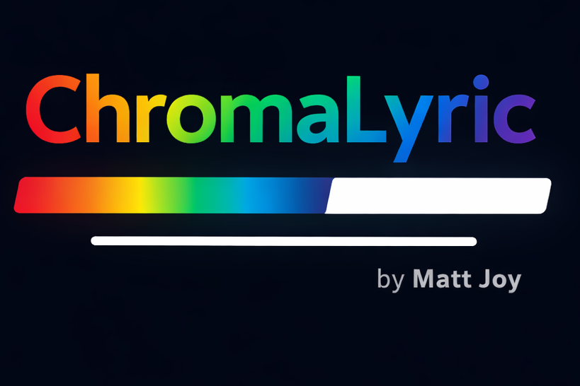
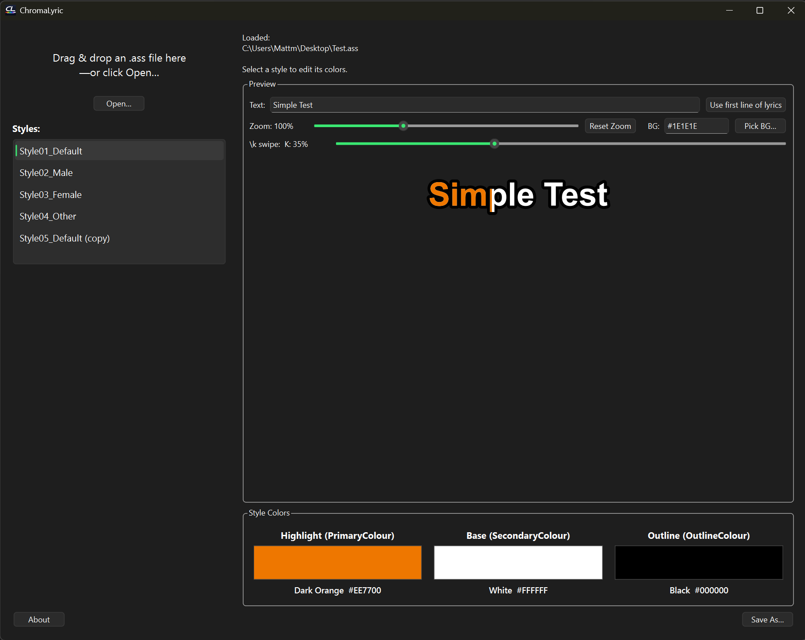
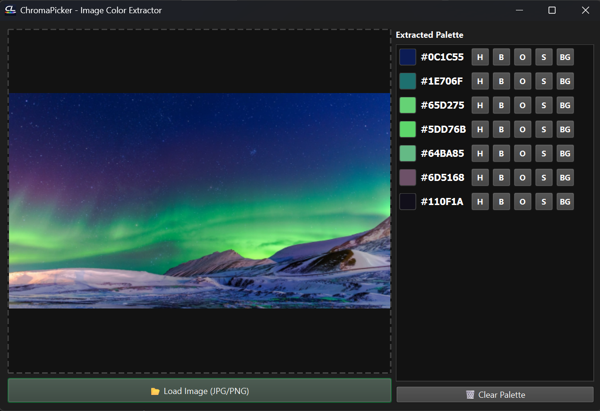
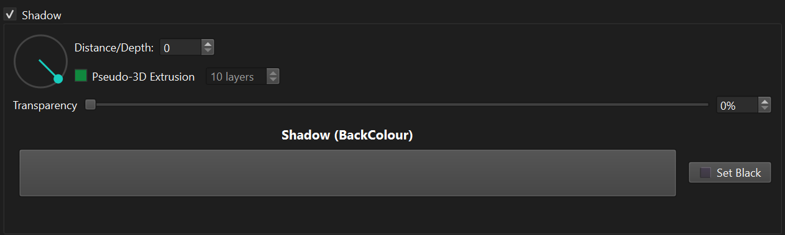

<h1 align="center">🎤 ChromaLyric</h1>

    ChromaLyric is a desktop tool for previewing and editing ASS (Advanced SubStation Alpha) subtitle style colors with a real-time karaoke visualization.
    Built for karaoke creators and subtitle stylists who want fast, accurate color iteration without rendering video.

  

__________________________________________________________________________________________

### 📸 Main App Screenshot

__________________________________________________________________________________________

### ✨ What It Does
ChromaLyric focuses on style-level editing inside .ass subtitle files:

* 🎨 **Edit Colors:** PrimaryColour, SecondaryColour, OutlineColour, and BackColour
* 🖥 **Live Preview:** Real-time preview of styles
* 🎶 **Karaoke Simulation:** Always-on karaoke highlight simulation
* 🔎 **Adjustable Zoom:** Zoom the preview for fine-tuning
* 🎚 **Karaoke Progress:** Adjustable swipe progress slider
* 🧾 **File Support:** Load and save .ass files directly with drag & drop support
* 📚 **Theme Library:** Save favorite color combinations as reusable presets
* 💾 **Persistent Memory:** Custom colors and themes persist across app restarts
* 🔄 **Import & Export:** Share creator color packs via .json files

__________________________________________________________________________________________

### 🎵 Karaoke Mode (Always Enabled)
ChromaLyric uses a simplified and predictable karaoke preview model:

* **SecondaryColour** - Base lyric fill
* **PrimaryColour** - Highlight swipe color
* **OutlineColour** - Text outline
* **BackColour** - Shadow

This mirrors common karaoke rendering behavior and makes color iteration intuitive.

__________________________________________________________________________________________

### 🖥 Accurate Preview Rendering
The preview:
* Uses the exact BackColour with no artificial shading
* Renders outline thickness scaled properly
* Respects typeface, font, bold, italic, underline, strikeout
* Uses pixel-sized scaling relative to a calibrated base preview scale

**Zoom control:**
* 100% = calibrated baseline (optimized for 1080p-style ASS usage)
* Adjustable from 25% to 250%

__________________________________________________________________________________________

### 📚 The Theme Library
ChromaLyric includes a built-in Preset Manager to speed up your workflow:

* Dial in your Highlight, Base, Outline, and Shadow colors.
* Click **"Save Current"** to add it to your persistent library.
* Double-click any saved preset to instantly apply it to your current ASS style.
* Export your library as a `.json` file to back it up or share it.

__________________________________________________________________________________________

### 👁️ ChromaPicker (Image Color Extractor)
Stop guessing hex codes. ChromaLyric 1.9.0 introduces a built-in, floating color extractor designed specifically for matching your karaoke styles to music video frames or anime episodes.

* **Pixel-Perfect Extraction:** Load any `.jpg` or `.png` reference frame and click anywhere with the crosshair to grab the exact RGBA color.
* **Extracted Palette History:** Every color you click is saved into a running swatch list alongside its exact hex code.
* **One-Click Routing:** Instantly send any extracted color directly to your active `.ass` style using the quick-transfer buttons: Highlight (H), Base (B), Outline (O), Shadow (S), or Preview Background (BG).
* **Live UI Syncing:** The picker floats over your workspace, meaning your main preview window updates in real-time as you route colors—no closing dialogs or copy-pasting required.

__________________________________________________________________________________________

### 🧊 Advanced 3D Shadows & Extrusion
ChromaLyric includes a built-in KFX (Karaoke Effects) engine to generate complex, directional shadows and retro 3D extrusions without requiring you to write a single line of override code.

* Using the Shadow panel, you can use the interactive radial dial to set a precise drop-shadow angle, or check Pseudo-3D Extrusion to stack up to 15 layers of your text for a deep, solid 3D effect.

* **🛠️ How it Works (The ChromaShadow Tag):** Standard .ass format does not natively support asymmetrical borders or 3D angles. To achieve this, ChromaLyric acts as a mini-rendering engine when you click "Save As...":

It mathematically calculates the offset for your chosen angle.

For 3D extrusions, it duplicates your dialogue lines, injecting precise \xshad and \yshad tags to build the extrusion layer by layer.

It automatically elevates your main text to a higher layer (Z-index) and cleans out conflicting shadow tags so tools like ffmpeg render the composite flawlessly.

* **Non-Destructive Editing:** Because generating a 15-step 3D effect creates 15 duplicate lines for every lyric, ChromaLyric safely tags these generated background layers with ChromaShadow in the standard ASS Effect column.

If you ever need to tweak your lyrics or colors later, simply drop the generated .ass file back into ChromaLyric. The app will instantly detect the ChromaShadow tags, strip the 3D layers out, and leave you with your clean, original lyrics ready for editing!

__________________________________________________________________________________________

### 📂 Supported File Type
* **.ass** (Advanced SubStation Alpha)

As of 1.10.0 ChromaLyric edits the **Styles** section of the file and Dialogue lines will be duplicated for advanced shadow effects. If you do not have a way to regenerate your `.ass` file and this concerns you, I suggest saving as a new file and not overwriting the original.

__________________________________________________________________________________________

### 🚫 What It Does NOT Do
* Does not render video
* Does not burn subtitles
* Does not require FFmpeg
* Does not modify dialogue timing

__________________________________________________________________________________________

### 🛠 How It Works Internally
1. Parses the `[V4+ Styles]` section.
2. Loads the style format definition.
3. Maps each style field dynamically.
4. Allows live modification of colors, outline size, and shadow effects.

No external tools are required.

__________________________________________________________________________________________

### 📦 Installation
Download the latest installer from the **Releases** page. Run the installer and launch ChromaLyric from the Start Menu.

__________________________________________________________________________________________

### 🧱 Technology
ChromaLyric is built with:
* **Python**
* **Qt / PySide6** (LGPL v3)
* **PyInstaller** (one-dir distribution)
* **Inno Setup** (Windows installer)

__________________________________________________________________________________________

### 📜 Licensing
ChromaLyric itself is proprietary software.
© 2026 Matt Joy. All rights reserved.

This application uses Qt / PySide6, licensed under the GNU Lesser General Public License v3 (LGPL-3.0). Qt source code is available at: https://code.qt.io/

__________________________________________________________________________________________

### 🎯 Intended Audience
* Karaoke video creators who use .ass files as an intermediary to final video production
* Works great for people who use **kbp2video** in the karaoke creation process

__________________________________________________________________________________________

### 💡 Design Philosophy
ChromaLyric is intentionally focused and lightweight. It exists to make color experimentation fast and provide visual confidence before rendering.
